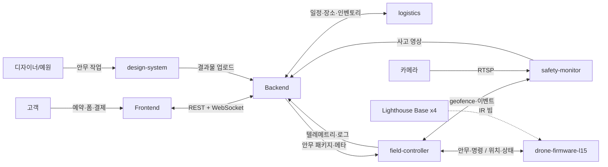

# 02. 모듈 간 인터페이스 카탈로그 (B)

> 작성일: 2026-05-06
> 단계: B. 모듈 간 인터페이스 카탈로그 (락) — C(데이터 흐름도) 진입 전 기준선
> 관련: `01_system_architecture.md`

---

## 0. 목적

A에서 정한 8개 모듈 책임 경계 위에, **모듈 간 어떤 데이터를 어떤 통신 방식으로 주고받는지** 정의.

---

## 1. 통신 그래프

---

## 2. 통신 방식 정리 (선택된 방식만)

| 방식 | 사용 영역 | 이유 |
|---|---|---|
| HTTPS REST | I1, I3, I4, I5, I6, I10 | 표준, 단순 요청·응답에 적합 |
| WebSocket | I2(알림), I7 | 양방향 실시간 (알림·텔레메트리 스트림) |
| gRPC | I8, I9 | 같은 머신 안 모듈 간 강한 양식 + 안전 직결 |
| RTSP | Camera → safety-monitor | 카메라 영상 스트림 표준 |
| Crazyradio 2.0 + cflib | I11, I12 | Crazyflie 표준, 보강 부담 적음 |
| IR 광학 (단방향) | Lighthouse → drone-firmware | Lighthouse Positioning 물리 메커니즘 |

---

## 3. 인터페이스 쌍 명세

| ID | 송신 → 수신 | 데이터 | 통신 방식 | 비고 |
|---|---|---|---|---|
| **I1** | frontend → backend | 예약·폼·결제·인증 요청 | HTTPS REST | OpenAPI 명세 |
| **I2** | backend → frontend | 응답 + 알림 (견적 OK·일정 변경) | REST + WebSocket | 알림은 WebSocket |
| **I3** | design-system → backend | 안무 JSON + 시뮬 영상 URL + 검증 결과 | HTTPS REST 업로드 | 디자이너 명시적 업로드 |
| **I4** | backend → logistics | 행사 일정·장소·드론 수 | HTTPS REST | OpenAPI |
| **I5** | logistics → backend | 인벤토리·이송 상태 | HTTPS REST | OpenAPI |
| **I6** | backend → field-controller | 안무 패키지(.skyc)·행사 메타 | HTTPS REST | 시연 전 일괄 다운로드 |
| **I7** | field-controller → backend | 텔레메트리 스트림·시연 시작/종료·로그 | WebSocket | 30대 × 수십 Hz |
| **I8** | field-controller → safety-monitor | geofence·시작/종료 신호 | gRPC | `.proto` 명세 |
| **I9** | safety-monitor → field-controller | 이상 탐지 이벤트 | gRPC | `.proto` 명세 |
| **I10** | safety-monitor → backend | 사고 영상 ±2분 (얼굴 blur 후) | HTTPS multipart upload | 1년 보유 (ADR-0001) |
| **I11** | field-controller → drone-firmware | 안무 다운로드·시작·sync·비상정지·미세 보정 | Crazyradio 2.0 + cflib | Crazyflie 표준 |
| **I12** | drone-firmware → field-controller | 위치·상태·배터리·이상 신호 | Crazyradio 2.0 + cflib | Crazyflie 표준 |
| (외) | Camera → safety-monitor | 영상 스트림 | RTSP | OpenCV·GStreamer 호환 |
| (외) | Lighthouse Base → drone-firmware | IR 위치 인식 빔 | IR 광학 | 단방향 (드론이 자체 계산) |

---

## 4. 모호 결정 락 (10개)

| # | 영역 | 결정 |
|---|---|---|
| α' | I2 frontend↔backend 실시간 | WebSocket |
| β' | I7 텔레메트리 | WebSocket |
| γ' | I8/I9 FC↔SM | gRPC |
| δ' | safety-monitor 설치 위치 | field-controller PC와 **같은 머신** (부하 시 추후 분리) |
| ε' | I3 업로드 | REST 파일 업로드 |
| ζ' | 인터페이스 정의 형식 | **OpenAPI** (REST) + **Pydantic** (공유 타입) + **.proto** (I8/I9 한정) |
| η' | I11/I12 드론 통신 | Crazyradio 2.0 + cflib (Crazyflie 표준) |
| θ' | 안무 다운로드 포맷 | **Skybrush `.skyc`** |
| ι' | B 결과물 위치 | **별도 파일** (본 파일) — 이전 결정 3 갱신 (§ 6 참조) |
| κ' | `shared/protocols/` 코드 작성 시점 | **본격 개발 시** (지금은 문서 명세만) |

---

## 5. `shared/protocols/` 코드 파일 (후순위, 본격 개발 시)

| 파일 | 용도 |
|---|---|
| `shared/protocols/openapi/backend.yaml` | REST API 명세 (I1, I2 응답부, I3, I4, I5, I6, I10) |
| `shared/protocols/proto/field_safety.proto` | gRPC 명세 (I8, I9) |
| `shared/protocols/types/` (Pydantic) | 모듈 간 공유 타입 (안무 데이터·텔레메트리·이벤트) |
| `shared/protocols/skyc/` | Skybrush `.skyc` 포맷 변환 유틸 (디자인 → 펌웨어 입력) |

---

## 6. 결과물 위치 결정 갱신 (이전 결정 3 → ι')

이전 결정 3에서 "`01_system_architecture.md` 단일 파일"로 정했으나, A·B·C·D·E 5단계 다 한 파일이면 비대 (~1000줄+ 예상). 단계별 별도 파일로 갱신:

- `01_system_architecture.md` — A. 모듈 책임 경계
- `02_interface_catalog.md` — B. 인터페이스 카탈로그 ← **본 파일**
- `03_data_flow.md` — C. 데이터 흐름 (예정)
- `04_communication_protocols.md` — D. 통신 프로토콜 디테일·시간 sync (예정)
- `05_failure_scenarios.md` — E. 장애·재시작 (예정)

ADR은 별도 트랙: `adr/NNNN-title.md`

---

## 7. 다음 단계

- ✅ **C. 데이터 흐름도** → `03_data_flow.md`
- ✅ **D. 통신 프로토콜 디테일** → `04_communication_protocols.md`
- **E. 장애·재시작 시나리오** — 다음
