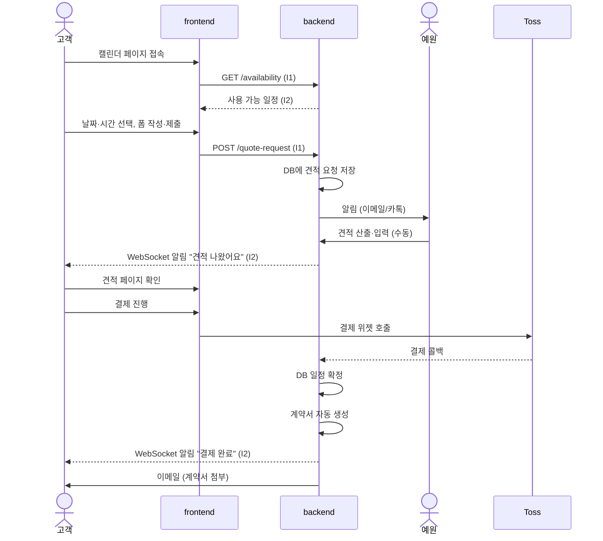
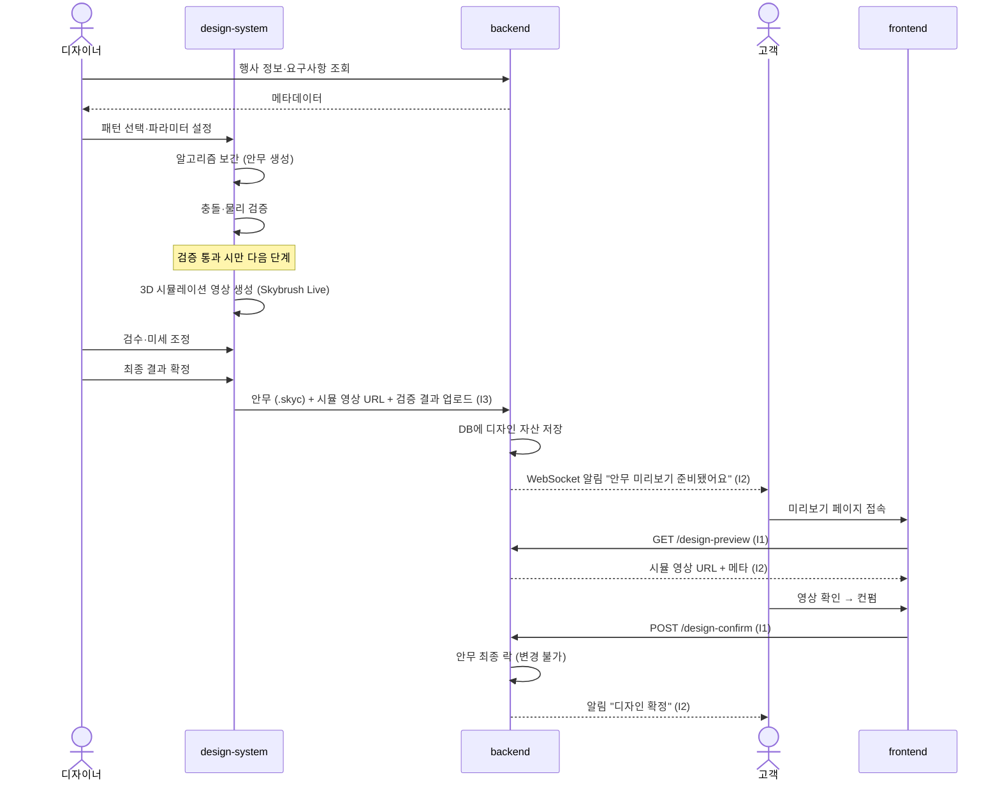
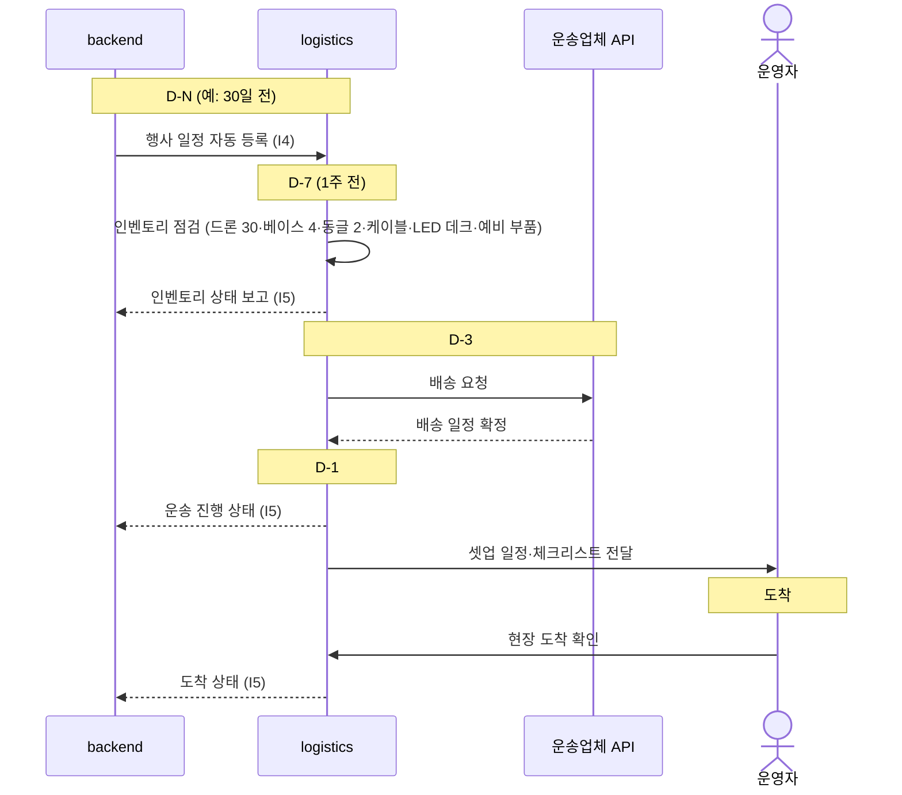
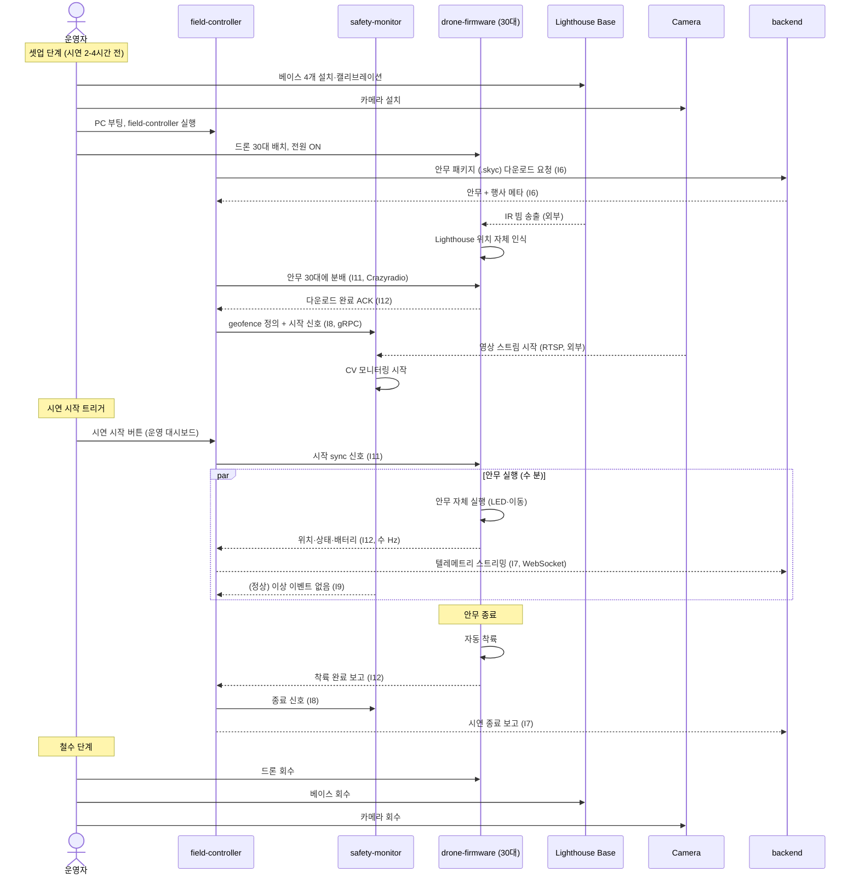
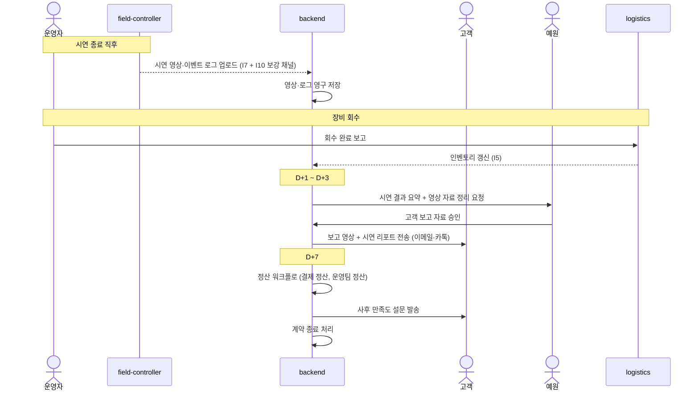
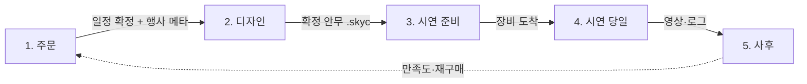

# 03. 데이터 흐름도 (C)

> 작성일: 2026-05-06
> 단계: C. 데이터 흐름도 (락) — D(통신 프로토콜 디테일) 진입 전 기준선
> 관련: `01_system_architecture.md`, `02_interface_catalog.md`
> 범위: **정상 흐름만** (사고·장애 분기는 E. 장애 시나리오에서)

---

## 0. 목적

A의 모듈 책임 + B의 인터페이스 위에, **시간 순서대로 어떤 모듈이 어떤 데이터를 어떤 순서로 주고받는지** 시퀀스로 정의. 시연 PR 영상 ≠ 시스템 흐름 — 이 문서는 시스템 관점.

5개 사이클:
1. 주문 (예약 → 견적 → 결제)
2. 디자인 (안무 작성 → 검증 → 컨펌)
3. 시연 준비 (D-N ~ D-1)
4. 시연 당일 (셋업 → 실행 → 철수)
5. 사후 (보고 → 정산)

---

## 1. 주문 사이클

**핵심**: 견적은 *수동 (예원)*, 나머지는 *자동*. 반자동 SaaS의 정의.

---

## 2. 디자인 사이클

**핵심**: 안무는 *알고리즘 자동 생성 + 사람 검수 + 고객 컨펌* 3단계 게이트. 미리보기 = 영업 자산.

---

## 3. 시연 준비 사이클 (D-N ~ D-1)

**핵심**: 시연 D-N부터 자동 트리거되는 일정 체인. 1인 운영 부담 최소화.

---

## 4. 시연 당일 사이클

**핵심**: 시연 자체는 *드론 자율 실행* (펌웨어 안무) + *현장 시스템 모니터링* (텔레메트리·안전). field-controller가 명령을 매 프레임 송출하지 않음 (사전 다운로드 + sync 모델).

---

## 5. 사후 사이클

**핵심**: 사후는 *backend 자동* 흐름이 대부분. 예원 개입은 보고 자료 *승인* 정도.

---

## 6. 사이클 간 관계

5개 사이클이 *순차적이지만 일부 병행* (디자인 진행 중에도 시연 준비 시작 가능, D-N가 충분히 길면).

---

## 7. 다음 단계

- ✅ A. 모듈 책임 경계 → `01_system_architecture.md`
- ✅ B. 인터페이스 카탈로그 → `02_interface_catalog.md`
- ✅ C. 데이터 흐름도 → 본 파일
- ✅ D. 통신 프로토콜 디테일 → `04_communication_protocols.md`
- **E. 장애·재시작 시나리오** — 다음 (시스템 아키텍처 5단계 마지막)
